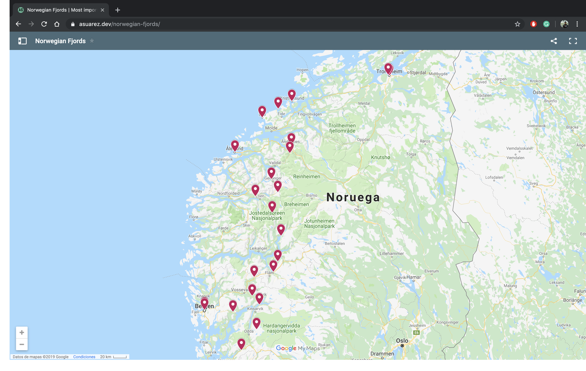

# Norwegian fjords

🗺 Interactive map with the most important places when visiting the Norwegian Fjords [here](https://asuarez.dev/norwegian-fjords)

## Summary

Along with [Elena](https://github.com/elena20ruiz) we did this road trip in Norway during 9-10 days. Strong recommended for all those who loves nature, hiking and being a bit isolated. Feel free to suggest new places in order to improve the map or question something about the trip 😄

## Preview

## Authors

- [Elena Ruiz](https://github.com/elena20ruiz)
- [Albert Suàrez](https://github.com/AlbertSuarez)

## License

MIT © Norwegian Fjords
